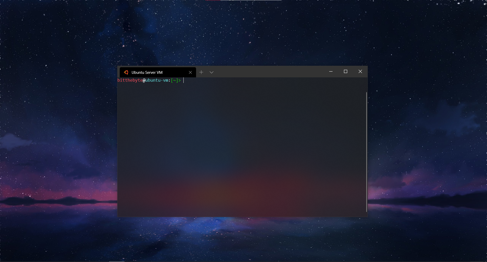
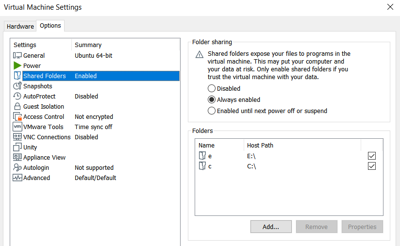
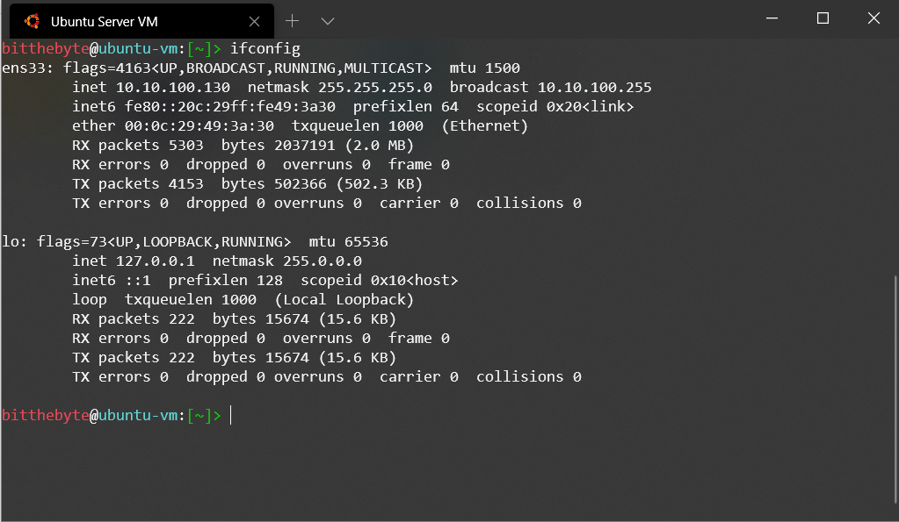
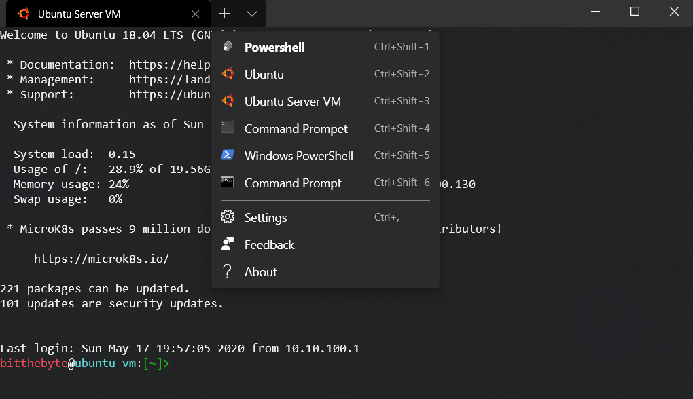

# Awesome SubSystem
This is my personal configuration as an alternative for using WSL 2 which currently requires Hyper-V to be enabled needless to say that Hyper-V impacts the whole system performance


# Requirements 
1) [WSL1](https://docs.microsoft.com/en-us/windows/wsl/install-win10) (mainly cause I use it so I bulid some of the scripts to work with it)
2) Install vmware with your favorite distribution (preferably Ubuntu Server 64bit) (guest machine)
3) Install sshpass on the host machine (WSL1)
```bash
$ sudo apt install sshpass
```
4) Install [Termnial Preview](https://www.microsoft.com/en-us/p/windows-terminal/9n0dx20hk701)

# Configurations

## 1. Enable shared folders 
After installing the distro and vmware tools:-
1) Open VMware and select your virtual machine
2) Navigate to VM > Settings > Options > Shared Folders


3) Enable shared folders and click Apply

## 2. Get guest machine IP
Login to your guest machine then run:-
```bash
$ ifconfig
```
At my case, the guest IP is `10.10.100.130` (remember it)



## 2. Applying settings.json to Termnial Preview
1) Open Termnial Preview and click on the little arrow
2) Open settings and paste my [settings.json](configs/settings.json)
3) Edit "Ubuntu Server VM" profile data to match yours
```json
"commandline": "bash -c \"sshpass -p Your-Guest-Password-Here ssh bitthebyte@Guest-IP-Here\""

eg.> "commandline": "bash -c \"sshpass -p MyPassword ssh bitthebyte@10.10.100.130\""
```

## 3. Editing guest's .bashrc
1) Login to your guest 
2) Run:-
```bash
nano .bashrc
```
3) At the end of the file paste
```bash
echo My-Guest-User-Password | sudo -S vmhgfs-fuse .host:/ /mnt/hgfs/ -o allow_other -o uid=1000 2> /dev/null
export PS1="\[\e[1;31m\]\u\[\e[1;36m\]\[\033[m\]@\[\e[1;36m\]\h\[\033[m\]:\[\e[0m\]\[\e[1;32m\][\W]> \[\e[0m\]"
alias dsk="cd /mnt/hgfs/c/Users/Windows-UserName-Here/Desktop"
```
4) Hit CTRL+X then Y

## 4. Install Terminal Icons
1) Using Windows Explorer navigate to [install.cmd](icons/install.cmd)
2) Double click on Install.cmd

# Optional 
Use the following commands to start VMware from WSL1
### Start VM (edit it to match yours)
```bash
/mnt/c/Program\ Files\ \(x86\)/VMware/VMware\ Workstation/vmrun.exe start "E:\Programs\VM\UbuntuVM\Ubuntu.vmx" nogui
```

### Stop VM (edit it to match yours)
```bash
/mnt/c/Program\ Files\ \(x86\)/VMware/VMware\ Workstation/vmrun.exe stop  "E:\Programs\VM\UbuntuVM\Ubuntu.vmx"
```

# Done
Now you're ready to go you can easily access the VM or WSL1 from the terminal

You can pretty much use it as WSL2 as it could access local drives with the benefit of not using Hyper-V
